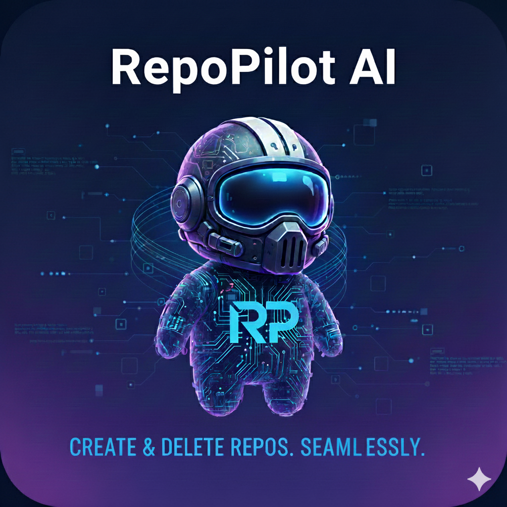

# RepoPilot AI: Automated Repository Management Agent

<p align="center">
  
</p>

<h1 align="center">🚀 RepoPilot AI</h1>

<p align="center">
  <strong>Create & Delete GitHub Repositories — Seamlessly. Automatically. Intelligently.</strong>
</p>

<p align="center">
  
  
  
</p>


## 🚀 Project Overview

RepoPilot AI is an intelligent agent designed to automate the lifecycle management of code repositories (creation and deletion) using natural language commands. It eliminates manual, repetitive setup tasks by integrating the power of the Google Gemini model's Function Calling capabilities with the GitHub API.

This project demonstrates how AI agents can reliably interpret complex, unstructured developer instructions (including required metadata like licenses, visibility, and .gitignore templates) and translate them into structured, executable API calls.

## ✨ Key Features

Natural Language Commands: Create or delete repositories using conversational instructions (e.g., "Create a private Python project named MyService with an MIT license").

Intelligent Metadata Extraction: Automatically parses critical repository parameters (name, description, visibility, license, etc.) from human text.

Reliable Function Calling: Uses Gemini to orchestrate external API calls, ensuring the correct action (creation or deletion) is executed with validated parameters.

## 📂 Folder Structure
```
RepoPilotAI/
│── agent.py
│── requirements.txt
│── README.md
│── .gitignore
│── .env ← NOT TRACKED BY GIT
│── init.py
│── venv/ ← LOCAL ONLY (DO NOT UPLOAD)
```

# 🔧 Installation & Setup

## 1️⃣ Clone the repository
```bash
git clone https://github.com/your-username/RepoPilotAI.git
cd RepoPilotAI

```

### 2️⃣ Create & activate a virtual environment

Windows

```bash
python -m venv venv
venv\Scripts\activate

```


macOS / Linux


```bash
python3 -m venv venv
source venv/bin/activate

```


### 3️⃣ Install dependencies

```bash

pip install -r requirements.txt

```


## 🔑 Configure Your .env
Create a .env file in the root folder.
Write secret credentials as below:

```bash

GITHUB_USERNAME=your_github_username
GITHUB_TOKEN=your_pat_token

```


## ⚠️ Important:
This token must have at least:

repo permissions

delete_repo permission

.env is already ignored via .gitignore.


## 🧠 How It Works (Architecture)
RepoPilot AI consists of three simple layers:

1. Input Layer
User provides:

Repository name

Description

Action (create/delete)

2. Secure Auth Layer
Reads credentials from .env file

3. GitHub API Layer
Uses requests to:

Send POST request to create repo

Send DELETE request to delete repo

The process is lightweight, fast, and beginner-friendly.

## 🔮 Future Enhancements
✨ Add repo renaming

✨ Support repo templates

✨ Auto-generate README for new repos

✨ Multi-agent system for DevOps workflows

✨ Web dashboard for non-technical users

