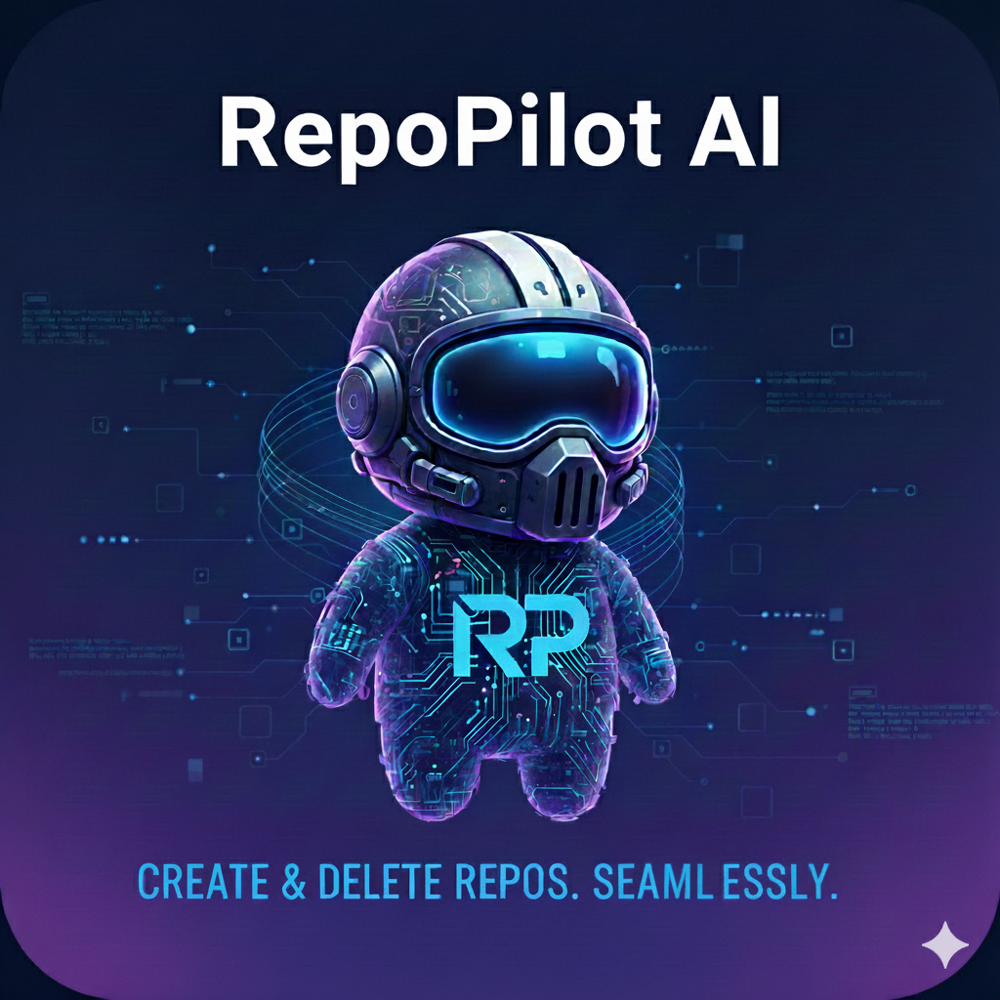

# RepoPilotAI — Exploring LLM-Driven Agents for Task Interpretation & Execution

<p align="center">
  
</p>

<h1 align="center">🚀 RepoPilot AI</h1>

<p align="center">
<strong>
  A lightweight AI agent that explores how large language models interpret ambiguous instructions and translate them into structured, executable actions.
</strong>
</p>

<p align="center">
  
  
</p>


## 🚀 Project Overview

RepoPilotAI is a lightweight AI agent built to explore how large language models (LLMs) can interpret high-level, natural-language instructions and convert them into structured actions using external APIs.

Rather than focusing on scale or production readiness, this project was designed as a learning experiment to understand:
- How LLMs extract structured parameters from unstructured text
- Where agent reasoning fails without constraints
- How function calling can reduce ambiguity in execution

The agent currently supports repository creation and deletion via the GitHub API, using Google Gemini’s function-calling capabilities as a controlled interface between model reasoning and deterministic code.

## Motivation

I built RepoPilotAI to move beyond prompt-based demos and explore how AI agents reason about real actions in the world.

As a self-taught software engineer transitioning toward AI research, I wanted to understand:
- How probabilistic model outputs interact with deterministic systems
- Why naive agent autonomy often fails
- How structure and validation improve reliability

This project represents my early steps toward research-oriented questions about agentic intelligence rather than a finished product.

## Agent Capabilities
- Interprets natural-language instructions to determine user intent (create vs delete)
- Extracts structured parameters (name, visibility, license) from free-form text
- Uses LLM function calling to bridge model reasoning with API execution
- Executes validated actions through the GitHub REST API

## Architecture & Reasoning Flow

User Instruction  
→ Prompt Construction  
→ LLM Reasoning (Intent + Parameters)  
→ Function Calling (Structured Output)  
→ Deterministic Validation  
→ GitHub API Execution  

The system deliberately separates probabilistic reasoning (LLM) from deterministic execution (Python logic) to reduce unintended actions.

## What I Learned

- LLMs confidently generate incorrect parameters when instructions are ambiguous
- Function calling significantly reduces unsafe or unintended executions
- Explicit constraints outperform purely autonomous loops
- Small agent systems fail in predictable ways that can be studied and improved

These observations motivated me to think more deeply about evaluation, safety, and structure in agent design.

## Limitations & Failure Cases

- The agent does not currently check for existing repositories before attempting creation
- No formal evaluation metrics are used
- The system lacks memory or multi-step planning
- Behavior depends heavily on prompt phrasing

These limitations are intentional and highlight areas for future experimentation.

## Why This Is Not Production-Ready

RepoPilotAI is intentionally not designed as a production system.

The goal of this project was to explore agent reasoning and tool execution using LLMs, not to optimize for scale, security, or robustness. As a result, several production concerns are intentionally out of scope:

- No formal authorization or role-based access controls
- Limited input validation beyond basic parameter checks
- No retry, rollback, or audit mechanisms
- No protection against prompt injection or malicious inputs
- No monitoring, logging, or cost control safeguards

These trade-offs allowed me to focus on understanding how probabilistic model reasoning interacts with deterministic code, and where structure is necessary to prevent unintended actions.


## Future Research Directions

- Introduce evaluation benchmarks for agent reliability
- Add multi-step planning and state tracking
- Experiment with memory-augmented agents
- Compare function calling vs tool-use approaches
- Study failure recovery mechanisms

## 📂 Folder Structure
```
RepoPilotAI/
│── agent.py
│── requirements.txt
│── README.md
│── .gitignore
│── .env ← NOT TRACKED BY GIT
│── init.py
│── venv/ ← LOCAL ONLY (DO NOT UPLOAD)
```

# 🔧 Installation & Setup

## 1️⃣ Clone the repository
```bash
git clone https://github.com/your-username/RepoPilotAI.git
cd RepoPilotAI

```

### 2️⃣ Create & activate a virtual environment

Windows

```bash
python -m venv venv
venv\Scripts\activate

```


macOS / Linux


```bash
python3 -m venv venv
source venv/bin/activate

```


### 3️⃣ Install dependencies

```bash

pip install -r requirements.txt

```


## 🔑 Configure Your .env
Create a .env file in the root folder.
Write secret credentials as below:

```bash

GITHUB_USERNAME=your_github_username
GITHUB_TOKEN=your_pat_token

```


## ⚠️ Important:
This token must have at least:

repo permissions

delete_repo permission

.env is already ignored via .gitignore.

